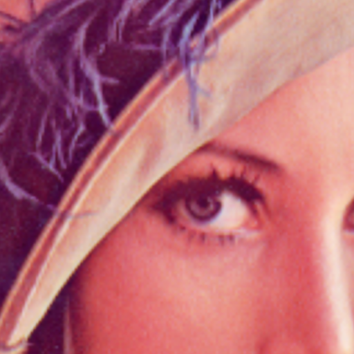
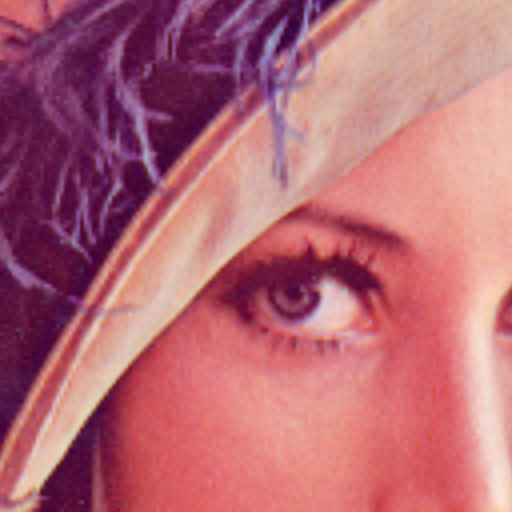
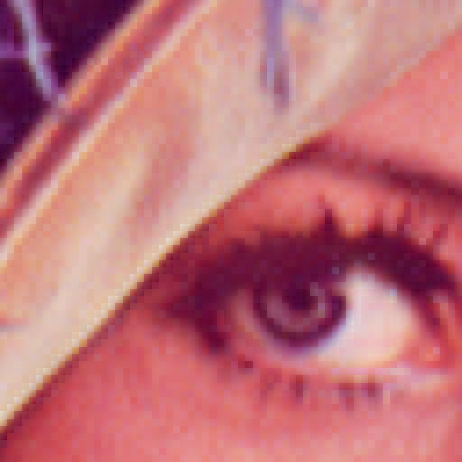

# stb-image-resize

Demo and compare files for [stb-image-resize](https://github.com/ImageProcessing-ElectronicPublications/stb-image-resize):

## Origin


---

---

### Upsampling x4 and cut out the center

#### GSample resamped

```shell
stbresize -r 4 -m -2 lena.png lena.x04.gsample.png 
Load: lena.png
image: 512x512:3
resize: 2048x2048:3
method: gsample
Save png: lena.x04.gsample.png
```


#### biLine interpolation

```shell
stbresize -r 4 -m -1 lena.png lena.x04.biline.png 
Load: lena.png
image: 512x512:3
resize: 2048x2048:3
method: biline
Save png: lena.x04.biline.png
```


#### biCubic interpolation

```shell
stbresize -r 4 -m 0 lena.png lena.x04.bicubic.png 
Load: lena.png
image: 512x512:3
resize: 2048x2048:3
method: bicubic
Save png: lena.x04.bicubic.png
```


#### biAkima interpolation

```shell
stbresize -r 4 -m 1 lena.png lena.x04.biakima.png 
Load: lena.png
image: 512x512:3
resize: 2048x2048:3
method: biakima
Save png: lena.x04.biakima.png
```



---

---

### Upsampling x4 and cut out the center (use RIS)

#### GSample resamped

```shell
stbresize -r 4 -m -2 -p 1 lena.png lena.x04.gsample.p1.png 
Load: lena.png
image: 512x512:3
resize: 2048x2048:3
method: gsample
RIS prefilter...  value: 0.001472
Save png: lena.x04.gsample.p1.png
```


#### biLine interpolation

```shell
stbresize -r 4 -m -1 -p 1 lena.png lena.x04.biline.p1.png 
Load: lena.png
image: 512x512:3
resize: 2048x2048:3
method: biline
RIS prefilter...  value: 1.748262
Save png: lena.x04.biline.p1.png
```


#### biCubic interpolation

```shell
stbresize -r 4 -m 0 -p 1 lena.png lena.x04.bicubic.p1.png 
Load: lena.png
image: 512x512:3
resize: 2048x2048:3
method: bicubic
RIS prefilter...  value: 1.153379
Save png: lena.x04.bicubic.p1.png
```


#### biAkima interpolation

```shell
stbresize -r 4 -m 1 -p 1 lena.png lena.x04.biakima.p1.png 
Load: lena.png
image: 512x512:3
resize: 2048x2048:3
method: biakima
RIS prefilter...  value: 1.109353
Save png: lena.x04.biakima.p1.png
```



---

---

### Upsampling x8 and cut out the center

#### GSample resamped

```shell
stbresize -r 8 -m -2 lena.png lena.x08.gsample.png 
Load: lena.png
image: 512x512:3
resize: 4096x4096:3
method: gsample
Save png: lena.x08.gsample.png
```



#### biLine interpolation

```shell
stbresize -r 8 -m -1 lena.png lena.x08.biline.png 
Load: lena.png
image: 512x512:3
resize: 4096x4096:3
method: biline
Save png: lena.x08.biline.png
```


#### biCubic interpolation

```shell
stbresize -r 8 -m 0 lena.png lena.x08.bicubic.png 
Load: lena.png
image: 512x512:3
resize: 4096x4096:3
method: bicubic
Save png: lena.x08.bicubic.png
```


#### biAkima interpolation

```shell
stbresize -r 8 -m 1 lena.png lena.x08.biakima.png 
Load: lena.png
image: 512x512:3
resize: 4096x4096:3
method: biakima
Save png: lena.x08.biakima.png
```


---

---

### Upsampling x8 and cut out the center (use RIS)

#### GSample resamped

```shell
stbresize -r 8 -m -2 -p 1 lena.png lena.x08.gsample.p1.png 
Load: lena.png
image: 512x512:3
resize: 4096x4096:3
method: gsample
RIS prefilter...  value: 0.000373
Save png: lena.x08.gsample.p1.png
```


#### biLine interpolation

```shell
stbresize -r 8 -m -1 -p 1 lena.png lena.x08.biline.p1.png 
Load: lena.png
image: 512x512:3
resize: 4096x4096:3
method: biline
RIS prefilter...  value: 1.745280
Save png: lena.x08.biline.p1.png
```


#### biCubic interpolation

```shell
stbresize -r 8 -m 0 -p 1 lena.png lena.x08.bicubic.p1.png 
Load: lena.png
image: 512x512:3
resize: 4096x4096:3
method: bicubic
RIS prefilter...  value: 1.195299
Save png: lena.x08.bicubic.p1.png
```


#### biAkima interpolation

```shell
stbresize -r 8 -m 1 -p 1 lena.png lena.x08.biakima.p1.png 
Load: lena.png
image: 512x512:3
resize: 4096x4096:3
method: biakima
RIS prefilter...  value: 1.144639
Save png: lena.x08.biakima.p1.png
```


---

---

